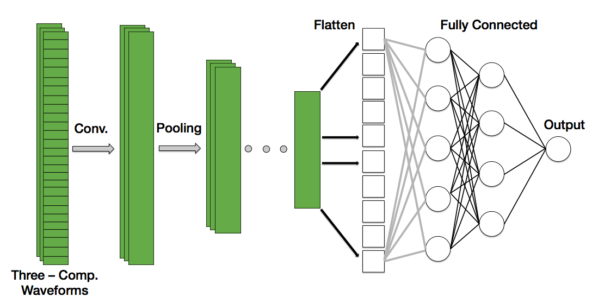
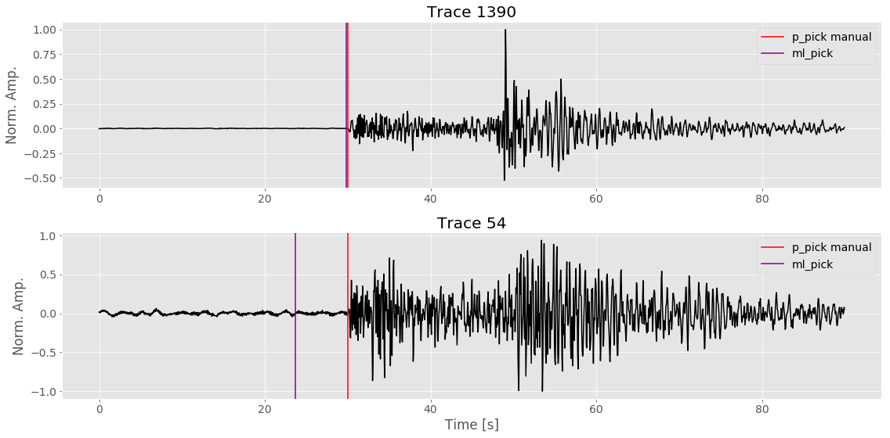

<!-- 

 
    <h3>Earthquake Phase Picking</h3>

  --> 

	<h3>Identifying Seismic Waves with Convolutional Neural Networks</h3>

<h2><a name="about">About</a></h2>  
This repository serves two purposes: 1) it is supplementary material for the “Identifying Seismic Waves with Convolutional Neural Networks” tutorial on my website: [insert website name here] and 2) it is a starting point for those who benefit from seeing an example, from start to finish, of how to train a 1D convolutional neural network to pick the first arriving seismic phase. This model has room for improvement and should serve only as a starting point.   

 
The machine learning pipeline stages included in this repository are:  

 
<b>Downloading Seismic Data</b> --> <b>Pre-Processing & Formatting</b> --> <b>Defining</b> --> <b>Compiling a 1D Convolutional Neural Network</b> --> <b>Training</b> 

<b>Figure:</b> Schematic of 1D convolutional neural network used to identify the first-arriving phase arrival of an earthquake. Note that each instance is composed of three channels, one for each component measuered by the seismometer (Z, N-S, and E-W). 

<h2>Table of Contents</h2>  

* [Dependencies](#dependencies)  
* [How to Use](#how)  
* [Acknowledgements](*acknowledgements)
* [Links](#links)   

<h2><a name="dependencies">Dependencies:</a></h2>  
All scripts are written in Python3. The following libraries (and their version) were also used:  

* NumPy 1.15.3  
* ObsPy 1.1.0  
* Pandas 0.23.0  
* Keras (on top of TensorFlow)  2.2.4  
* TensorFlow 1.8.0  
* Matplotlib  

<h2><a name="how">How to Use</a></h2>  
Run the following .py scripts in the following order in order to replicate what was done for the tutorial. Make note of where each output directory is stored relative to your home directory.   

* /bin/download_data/define_stations.py  
* /bin/download_data/get_quakefiles.py  
* /bin/download_data/get_mass_picks.py  
* /bin/download_data/get_mass_data.py [currently not included]  
* / bin/pre_process/make_data_set.py  
* /bin/pre_process/format_waveforms.py  
* /models/p_phase_picker.py  

<b>Figure:</b> Example waveforms and their associated first arrival using the [Baer Pick](https://pubs.geoscienceworld.org/ssa/bssa/article-abstract/77/4/1437/119016/an-automatic-phase-picker-for-local-and?redirectedFrom=PDF) method (in red) and the machine learning (purple) pick.  

<h2><a name="acknowledgements">Acknowledgements</a></h2> 
Waveform data, metadata, or data products for this study were accessed through the Northern California Earthquake Data Center (NCEDC), doi:10.7932/NCEDC.

<h2><a name="links">Links</a></h2>  

* Find the blog here: [Identifying Seismic Waves with Convolutional Neural Networks]()
* <a href = "https://github.com/ngrayluna/P_Phase_Picker">Source Code</a>  
* [Northern California Earthquake Data Center](http://ncedc.org/index.html)

